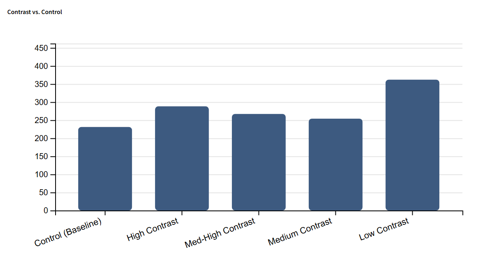
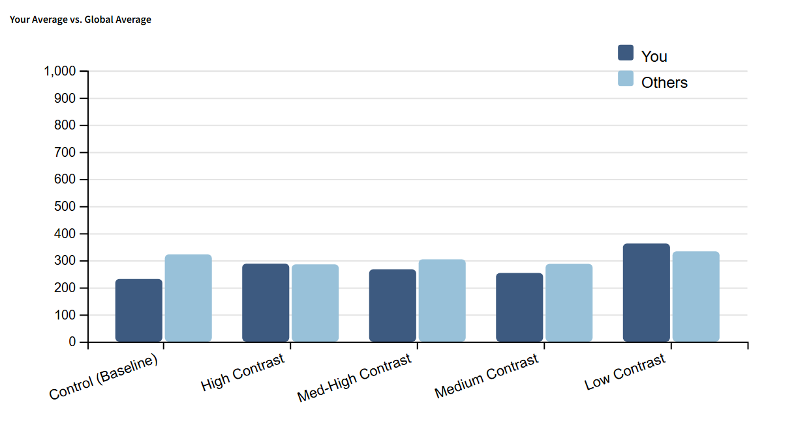

Assignment 3 - Replicating a Classic Experiment  
===
Created by: Anthony Coutts, Peter Czepiel, and Timothy Hutzley
---
**Project Description and Background**
--- 
Our experiment looks to build on and recreate previous research findings that colors that are closer together are harder for users to notice the difference and react to it. This type of experiment is useful in the visualization space because color is a visual feature that can often be processed preattentively, meaning differences can be detected rapidly without focused attention when the perceptual contrast is sufficiently large. So, understanding at what contrast level is sufficently large for humans to immediately notice the difference can be helpful visualization design.

Our experiment tests the users' reaction time to colors with different amounts of contrast appearing on the screen. We conducted our experiment by making the user do three tests in each of our four trials (12 total tests). Our group believes that the reaction time of users will be quicker when testing on colors of higher contrast. We measure contrast using perceptual color distance (∆E) in CIELAB space, as prior work has shown that classical just-noticeable-difference (JND) assumptions underestimate the color separations required for reliable discrimination in visualization contexts (Szafir, 2018). This research modeled perceptual color discriminability in visualization tasks, which helped inform our four contrast levels outlined below:

1. Low Contrast: ∆E range 10-15
2. Medium Contrast: ∆E range 25-30
3. Medium-High Contrast: ∆E range 40-45
4. High Contrast: ∆E range 60-75

While the research also highlights size and shapes as factors in color discriminibilty, we selected these ranges to isolate the effect of perceptual color difference on reaction time.

These four trials will consist of three tests each where the user will be shown a starting color, then be asked to click whenever they see that color change. To remove as many other variables as possible, we chose our colors using Lab space (instead of RGB or Hex). We generated our 24 color palette using the Brown University Color Palette Generator and then adjusted the colors to fit our desired ∆E ranges. ∆E values were computed using the colormine ∆E calculator. Along with these four trials, we added a control (baseline) trial at the beginning to help with creation of the charts at the end of the study. For the control test we chose a bright red and bright green. The colors for this trial are the same for each test, allowing the user to take the average of three tests to find their baseline reaction time.

**Chosen Colors and Test Layout**
---
*Please note all colors below have been converted to their approximate HEX color because Github README does not support Lab colors*

| Contrast Rating | Test 1 | Test 2 | Test 3 |
| :--- | :--- | :--- | :--- |
| **Low** (10-15) |   |   |   |
| **Medium** (25-30) |   |   |   |
| **Med-High** (40-45) |   |   |   |
| **High** (60-75) |   |   |   |

**Results and Visualizations**
---
At the end of their tests, users will be given two charts populated with data for them to look at. 
1. The first will be a chart that shows how different their reaction time was in each contrast level compared to their average on the control (baseline) trial. This chart will be populated with only data from one user. 
2. The second chart will show how the average all of their tests compared with the average of all other users' tests in each contrast category, including the control (baseline) level.

Here are two examples of what the charts look like:
- 
-  

After conducting 15 separate trials we ended up with the following average reaction times:
- Control (Baseline) - 321.8ms
- High Contrast - 285.4ms
- Med-High Contrast - 303.9ms
- Med Contrast - 286.9ms
- Low Contrast - 333.3ms

The control (baseline) which was the first reaction time test ended up serving more as a warmup for the actual experiment rather than serving as a proper baseline (based on participant feedback, running the experiment ourselves, and confirming this behavior in the screen recordings).

Overall, the faster groups ended up being high-contrast and med contrast colors, while med-high was slightly slower, with low contrast easily having the slowest average reaction time.

When comparing each of the other contrast groups to high contast, the results were:
- Med Contrast - 1.5ms slower (0.5% slower) &rarr basically the same

**Technical Achievements**
---

1. Timing Consistency:
- It was brought to our attention through our first few tests that using Javascript commands like *setTimeout()* may lead to a delay in the collection of the users reaction time. To mitigate this and record the most accurate reaction times possible, we measure the time immediately by using a *requestAnimationFrame* or rAF loop and timestamp the exact moment the SVG color actually changes. We also calcuate the reaction time using *performance.now()* to ensure that all times are calculated down to the microsecond. These help reduce any issues with browser speed or other outside variables.
2. Differing Intervals:
- To ensure that the user is surprised by the change of the color each time, we use *Math.random()* to generate a delay between 3,000 and 10,000 milliseconds. This prevents users from prematurely preparing for the color change and makes all test genuine.
3. Backend:
- To store the reaction time data we decided to create a simple backend using Express + Node.js with MongoDB. This was to ensure the data was persistent across all experiments so that the current user's reaction time could be contrasted with the global averages from all other particpants. 
4. Deployment:
- For easy access to the site, we decided to deploy it using Vercel as it was geneally easy to setup and could manage hosting both our static html page as well as our backend.
5. ReVISit:
- On top of deploying the site using Vercel, to help us track the number of participants in real-time and ensure that the experiment was running smoothly, we utilized ReVISit to host the Vercel site for studies. We enabled screen recording to help us determine if the experiment was going well and stored the videos using ReVISits built-in firebase storage setup. 

**Design Achievements**
---

1. One Page Experience:
- Our application has three different "pages" that the user accesses during their experiment (start page, main experiment page, chart page). While this looks like three seperate pages to users, all of the code is held within one HTML file. This make it so the user does not have to wait for loading times while switching between pages (which may have been the case if using a framework like React).
2. Clean UI:
- Because our experiment is centered around focusing on the exact moment when their is a change in color (sometimes a small change), we chose to keep the layout of the site very clean and non-distracting. This helps the user focus on the colored square without being distracted by other elements of the page.
3. Lab Colors:
- In our app, we chose to use colors within the Lab space rather than other spaces like RBG or Hex. We decided to do this because of the "5% change" example that we discussed in class. In spaces like RGB or Hex (used in most applications), a 5% difference in color is not very noticable because there is no "Lightness" metric like Lab has. This choice makes it easier for users to distinguish small changes in contrast.

**Resources**
---
- Szafir, 2018: https://pubmed.ncbi.nlm.nih.gov/28866544/
- ∆E calculator: https://colormine.org/delta-e-calculator
- Brown University Color Palette Generator: http://vrl.cs.brown.edu/color
- Lab to Hex Conversion for README: https://www.nixsensor.com/free-color-converter/?srsltid=AfmBOoroXBHQHl3y9riHy3LYlBupOlmsAERbdpeboL6-LybPIix5yGqs
- Website and Documentation for Small Colored Squares in README: https://shields.io/badges
